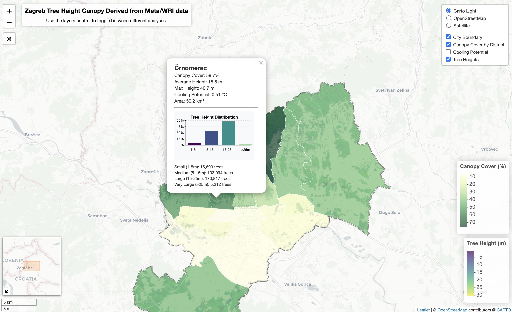

# Zagreb Tree Height Canopy Analysis

## Overview

This repository contains an R-based analysis of Zagreb's urban trees using high-resolution tree canopy data. 
The project analyzes the distribution of tree cover across Zagreb's administrative districts, calculates urban 
cooling potential, tree heights distributions, and presents the results in an 
interactive Leaflet map.

## Data Source

The analysis uses the global tree canopy height dataset from Meta/WRI accessed through the chmloader package:

- Paper: [Global 1m resolution canopy height maps from high-resolution satellite imagery](https://www.sciencedirect.com/science/article/pii/S003442572300439X)
- Data access: Available via Google Earth Engine and AWS

Administrative boundaries: City and district boundaries from OpenStreetMap.

## Features
- **Administrative boundaries**: City and district boundaries from OpenStreetMap
- **Canopy metrics**: Coverage percentage, mean height, max height by district
- **Height distribution**: Analysis of tree heights across different categories
- **Urban cooling**: Estimation of heat island mitigation potential
- **Interactive visualization**: Multi-layer Leaflet map with popup information

## How It Works
The analysis follows these main steps:

1. Boundary definition: Downloads Zagreb city and district boundaries from OpenStreetMap
2. Canopy data acquisition: Retrieves high-resolution canopy height data for the entire city
3. District metrics calculation: Computes tree canopy statistics for each district
4. Height distribution: Calculates tree heights across ifferent categories - Small (1-5m), Medium (5-15m), Large (15-25m), Very Large (>25m)
5. Cooling potential estimation: Calculates urban heat island mitigation potential based on canopy cover and tree height
6. Visualization: Creates an interactive Leaflet map with multiple layers
7. Results export: Saves the interactive map as an HTML file 

## Urban Cooling Potential Methodology
The cooling potential calculation is based on research showing how trees mitigate urban heat islands through shading 
and evapotranspiration. The formula incorporates both canopy coverage percentage and tree height:

cooling_potential = cooling_factor_base * canopy_cover_pct/100 + 
                    cooling_factor_height * mean_height * canopy_cover_pct/100

This approach is supported by research from Rahman et al. (2017) and Norton et al. (2015) which have established 
that cooling effects scale with both canopy coverage and tree height.

## Usage
To run the analysis:  
1. Clone this repository  
2. Install required packages    
3. Run the main script `tree_canopy_height.R`

The main output is an interactive HTML map that can be opened in any web browser, allowing exploration of 
different aspects of Zagreb's urban trees.

## Results
The analysis reveals significant disparities in tree canopy coverage across Zagreb's districts, with values ranging 
from as low as 8% in central districts to over 75% in peripheral areas. These patterns have important implications 
for urban cooling and environmental equity.
Districts with both high canopy coverage and tall trees show the highest cooling potential, while densely built central areas 
demonstrate minimal cooling effects from existing trees.

## Future Development
Potential future developments include:  
1. Integration of thermal imagery to analyze the relationship between tree canopy and measured surface temperatures  
2. Conversion to a Shiny application to allow more interactive exploration of the data

## License
This project is licensed under the MIT License - see the LICENSE file for details.

## Acknowledgments
1. Thanks to the Meta/WRI team for providing the global canopy height dataset
2. OpenStreetMap contributors for the administrative boundary data
3. The `chmloader` package developers for facilitating access to canopy height data

## References
1. Rahman, M.A., Moser, A., Rötzer, T., & Pauleit, S. (2017). Within canopy temperature differences and cooling 
ability of Tilia cordata trees grown in urban conditions. Building and Environment, 114, 118-128.
(https://doi.org/10.1016/j.buildenv.2016.12.013)
2. Norton, B. A., Coutts, A. M., Livesley, S. J., Harris, R. J., Hunter, A. M., & Williams, N. S. G. (2015). Planning 
for cooler cities: A framework to prioritise green infrastructure to mitigate high temperatures in urban landscapes. 
Landscape and Urban Planning, 134, 127-138. (https://doi.org/10.1016/j.landurbplan.2014.10.018)

## Contact
For questions or collaboration opportunities regarding this project, please contact me at:
marijana@andalytics.com  
[LinkedIn](https://www.linkedin.com/in/marijana-andabaka/)  
[Website](https://andalytics.com/en/)  

